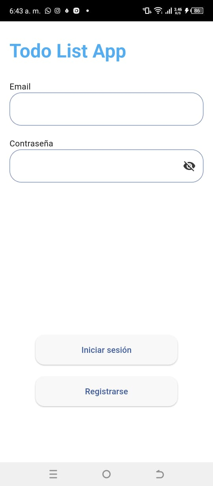
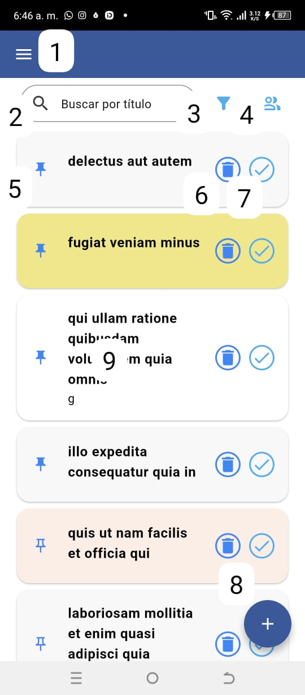
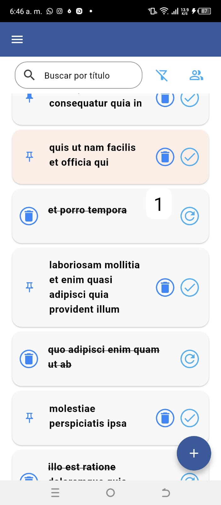
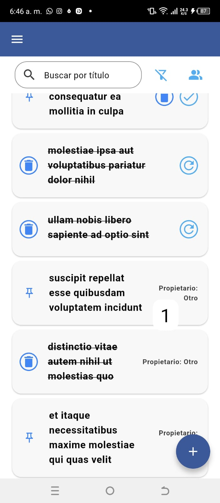
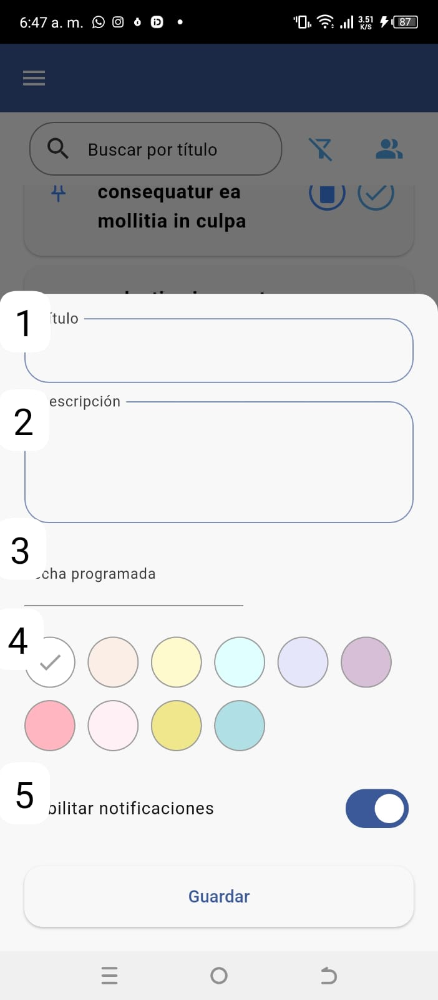
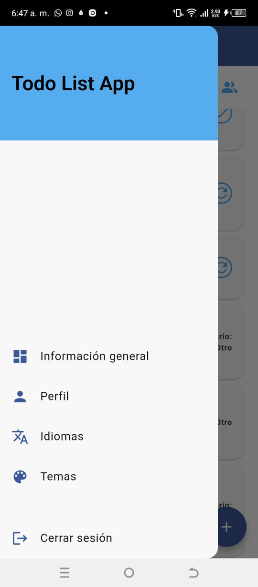
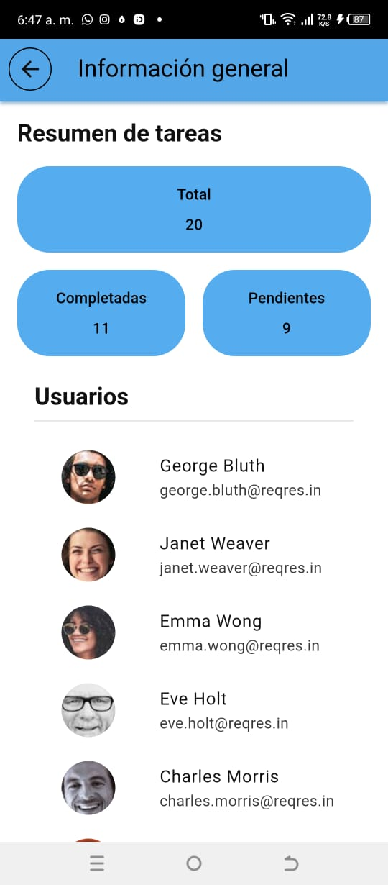
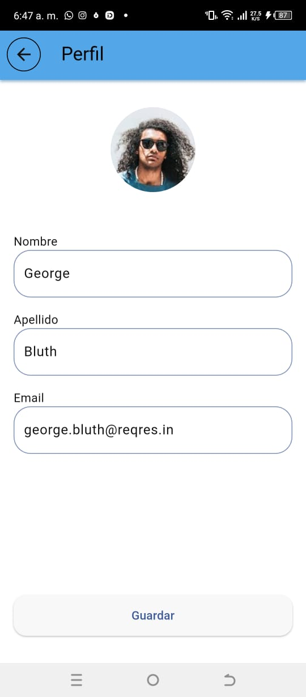
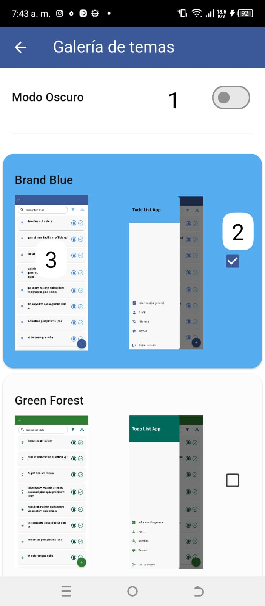

# Todo List App

Todo List App is a Flutter application that helps users manage their tasks efficiently.

Implements ReqRes API to simulate user authentication. https://reqres.in/

Implements JsonPlaceholder API to simulate task management. https://jsonplaceholder.typicode.com/

## Table of Contents
- [Features](#features)
- [Getting Started](#getting-started)
   - [Prerequisites](#prerequisites)
   - [Installation](#installation)
- [Usage](#usage)
   - [Authentication](#authentication)
   - [Task Management](#task-management)
   - [Drawer Menu](#drawer-menu)
   - [Dashboard](#dashboard)
   - [User Profile](#user-profile)
   - [Themes](#themes)
- [Contributing](#contributing)
- [Contact](#contact)
eve
## Features

- User Authentication (Login, Register, Logout)
- Task Management (Add, Update, Delete, Sync Tasks)
- Task Filtering (All, Completed, Incomplete)
- Task Pinned (Pin/Unpin tasks)
- Task Search (Search tasks by title)
- Collaborative Task Management (Share tasks with other users)
- Tasks customization (Change task color)
- Task Notifications (Reminders for scheduled tasks)
- Task Persistence (Local storage) 
- Ability to restore deleted and completed tasks
- Language Support (English, Spanish)
- Dashboard with task statistics (Total, Completed, Incomplete)
- User Listing (View all users)
- User Profile (View user details and edit profile)
- App Customization (Change app theme between multiple themes)
- Dark Mode Support

## Getting Started

### Prerequisites

- [Flutter](https://flutter.dev/docs/get-started/install) (version 3.27.1 or higher)
- [Dart](https://dart.dev/get-dart) (version 3.6.0 or higher)

### Installation

1. Clone the repository:
   ```sh
   git clone https://github.com/GabrielChorens/todo_list_app.git
   cd todo_list_app
    ```
   
2. Install dependencies: 
   ```sh
   flutter pub get
   ```
   
3. Run the app:
   ```sh
    flutter run
    ```
   
### Usage

## Authentication



 - Login with the following credentials:
   - Email: eve.holt@reqres.in
   - Password: 123456
 
 - Or register one of the following users:
    [User List](https://reqres.in/api/users?per_page=12)
 
 - Notes:
  - ReqRes API does not validate passwords, so any password should work. However, we established a password policy for the app. Any password not being 123456 will be considered wrong in order to simulate a real authentication system.
  - The app will remember the user's session until the user logs out.
  - Attempting to use any other email will result in an error message.
  - All fields are required to register or login.

## Task Management



1. Menu button: Access the app menu.
2. Search button: Search tasks by title.
3. Filter button: Show tasks that are complete and allows the different actions that they can perform. Initially shows only the incomplete tasks.
4. Collaboration button: Show tasks that belong to other users. Initially shows only the user's tasks.
5. Pin button: Pins a task to the top of the list.
6. Delete button: Deletes a task.
7. Check button: Marks a task as complete.
8. Add button: Add a new task.
9. On tap a task: Edit a task.



1. Redo button: Restore a completed task.
 


1. Task owner: Shows the task owner's email (ideally), currently just shows other. Not owner tasks can't be edited yet can be deleted from your view.



1. Title: Task title. It's required.
2. Description: Task description. It's optional.
3. Date: Task date. It's optional. When set the task receives a due date and in case you enable notifications you will receive a reminder.
4. Color: Task color. It's optional. You can choose between 10 colors.
5. Notification: Task notification. It's optional. When enabled you will receive a reminder at the task date.

#Remember to save the task after editing it.

## Drawer Menu



1. Dashboard: Shows the user's task statistics and the total number of users.
2. User profile: Shows the user's details and allows the user to edit their profile.
3. Language: Change the app language between English and Spanish.
4. Theme: Change the app theme between multiple themes and enable dark mode.
5. Logout: Log out of the app.

## Dashboard



1. Total tasks: Shows the total number of tasks.
2. Completed tasks: Shows the total number of completed tasks.
3. Incomplete tasks: Shows the total number of incomplete tasks.
4. Users: Shows a preview of all users in ReqRes API.

\* The dashboard is a mere informative screen and does not allow any interaction.

## User Profile



1. Avatar: User's avatar (not editable).
2. Name: User's name (editable).
3. Last name: User's last name (editable).
4. Email: User's email (not editable ideally but editable in the app since anyway there are discrepancies in the ReqRes API).
5. Save button: Save the user's changes.

## Themes



\* The app various contrasting themes and dark mode support. Hopefully, you will find one that suits your taste.

1. Dark mode switch: Enable or disable dark mode.
2. Theme selection: Choose between multiple themes by pressing his respective checkbox.
3. On screenshot tap: Allows you to see the theme in full screen.


## Contributing

Contributions are what make the open-source community such an amazing place to learn, inspire, and create. Any contributions you make are **greatly appreciated**.

1. Fork the Project
2. Create your Feature Branch (`git checkout -b feature/AmazingFeature`)
3. Commit your Changes (`git commit -m 'Add some AmazingFeature'`)
4. Push to the Branch (`git push origin feature/AmazingFeature`)

## Contact
If you have any questions, feel free to contact me at

- Email: gabrielchorens@gmail.com

